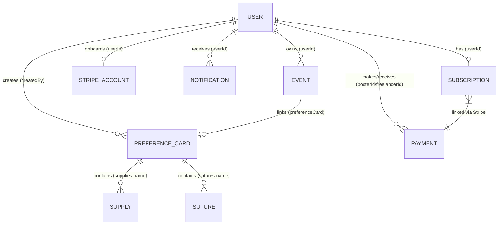

# Database Design & Relationships

Ei document ta **TBSOSICK** system er full database architecture ebong model relationships gulo describe kore. MongoDB (NoSQL) use kora hoyeche jekhane data scalability ebong performance ke priority deya hoyeche.

---

## Data Models Overview

Amader system e main collections gulo holo:

1.  **Users**: Central user management (Admin, Doctors/Users).
2.  **Preference Cards**: Doctors der surgery-specific preferences.
3.  **Subscriptions**: User-er billing plans ebong access levels.
4.  **Supplies & Sutures**: Inventory items ja preference card e use hoy.
5.  **Payments & StripeAccounts**: Billing transactions ebong vendor onboarding info.
6.  **Notifications**: In-app ebong push notification tracking.

---

## Entity Relationship Map

---

## Detailed Schema Design

### 1. User Model (`users`)
System er primary entity. Role-based access control (RBAC) eikhan theke managed hoy.
- **Fields**: `name`, `email`, `password`, `role`, `status`, `verified`, `specialty`, `hospital`, `deviceTokens`.
- **Logic**: `tokenVersion` use kora hoy token rotation ebong security-r jonno.

### 2. Preference Card Model (`preferencecards`)
Surgery workflow optimize korar jonno main data entity.
- **Relationships**:
  - `createdBy`: String (User ID) — Reference to `User`.
  - `supplies.name`: ObjectId — Reference to `Supply`.
  - `sutures.name`: ObjectId — Reference to `Suture`.
- **Embedded Data**: `surgeon` info (name, handPreference, specialty) sub-schema hisebe embed kora hoyeche performance er jonno.

### 3. Subscription Model (`subscriptions`)
User-er access control ebong billing logic handle kore.
- **Relationship**: `userId` — Reference to `User` (Unique).
- **Fields**: `plan` (FREE, PREMIUM), `status` (ACTIVE, EXPIRED), `stripeSubscriptionId`.

### 4. Payment & StripeAccount (`payments`, `stripeaccounts`)
- **Payment**: `taskId`, `posterId`, `freelancerId`, `amount`, `status`.
- **StripeAccount**: `userId`, `stripeAccountId`, `onboardingCompleted`.

---

## Performance & Optimization

### Indexing Strategy
- **Unique Indexes**: `users.email`, `subscriptions.userId`.
- **Compound Indexes**: `PreferenceCard` e `createdBy` index kora hoyeche fast lookup er jonno.
- **Sparse Indexes**: `googleId` sparse index use kora hoyeche OAuth flexibility-r jonno.

### Query Patterns
- **Aggregation**: Doctor search flow te `PreferenceCard` ebong `Subscription` lookup kora hoy complex analytics (e.g., total cards count, active status) generate korar jonno.
- **QueryBuilder**: Standard list filtering ebong pagination er jonno [QueryBuilder](file:///src/app/builder/QueryBuilder.ts) use kora hoy.

---

---

## Detailed Schema Reference

Eikhane protiti model er fields, tader type, ebong tara required naki optional ta deya holo. Sathe relevant **Enums/Roles** o thakbe.

### 1. User Model (`users`)
System er sob users (Admin ebong Doctors) er data eikhane thake.

| Field | Type | Required | Description / Enum |
| :--- | :--- | :---: | :--- |
| `name` | String | ✅ | User er full name |
| `email` | String | ✅ | Unique email address |
| `password` | String | ⚠️ | Required for non-OAuth users (select: false) |
| `role` | String | ✅ | `SUPER_ADMIN`, `USER` (Doctor) |
| `status` | String | ✅ | `ACTIVE`, `INACTIVE`, `RESTRICTED`, `DELETE` |
| `verified` | Boolean | ✅ | Email verification status |
| `country` | String | ✅ | User's country |
| `phone` | String | ✅ | Contact number |
| `specialty` | String | ❌ | Doctor's specialty (optional) |
| `hospital` | String | ❌ | Hospital name (optional) |
| `tokenVersion`| Number | ✅ | Security token rotation er jonno |
| `deviceTokens`| String[] | ❌ | Push notification tokens |

---

### 2. Preference Card Model (`preferencecards`)
Surgery-specific preference data.

| Field | Type | Required | Description |
| :--- | :--- | :---: | :--- |
| `createdBy` | String | ✅ | Creator User ID (Reference) |
| `cardTitle` | String | ✅ | Title of the card |
| `surgeon` | Object | ✅ | Embedded Surgeon info (Name, Specialty, etc.) |
| `medication` | String | ✅ | Required medication list |
| `supplies` | Array | ✅ | Items from `Supply` collection |
| `sutures` | Array | ✅ | Items from `Suture` collection |
| `published` | Boolean | ✅ | Default: `false` |
| `verificationStatus` | String | ✅ | `VERIFIED`, `UNVERIFIED` |

---

### 3. Subscription Model (`subscriptions`)
User access control logic.

| Field | Type | Required | Description / Enum |
| :--- | :--- | :---: | :--- |
| `userId` | ObjectId | ✅ | Reference to `User` (Unique) |
| `plan` | String | ✅ | `FREE`, `PREMIUM`, `ENTERPRISE` |
| `status` | String | ✅ | `active`, `trialing`, `past_due`, `canceled`, `inactive` |
| `currentPeriodEnd`| Date | ❌ | Expiry date for the plan |

---

### 4. Payment Model (`payments`)
Billing transactions tracking.

| Field | Type | Required | Description / Enum |
| :--- | :--- | :---: | :--- |
| `taskId` | ObjectId | ✅ | Reference to `Task` |
| `posterId` | ObjectId | ✅ | Reference to `User` (Payer) |
| `freelancerId` | ObjectId | ✅ | Reference to `User` (Receiver) |
| `amount` | Number | ✅ | Total amount |
| `platformFee`| Number | ✅ | System fee |
| `status` | String | ✅ | `pending`, `held`, `released`, `refunded`, `failed` |
| `stripePaymentIntentId` | String | ✅ | Stripe transaction ID |

---

### 5. Notification Model (`notifications`)
In-app and push notification tracking.

| Field | Type | Required | Description / Enum |
| :--- | :--- | :---: | :--- |
| `userId` | String | ✅ | Target User ID |
| `type` | String | ✅ | `PREFERENCE_CARD_CREATED`, `EVENT_SCHEDULED`, etc. |
| `title` | String | ✅ | Notification header |
| `subtitle` | String | ❌ | Detailed message |
| `read` | Boolean | ✅ | Read status (default: false) |
| `resourceType`| String | ❌ | `PreferenceCard`, `Event`, etc. |
| `resourceId` | String | ❌ | ID of the linked resource |

---

### 6. Event Model (`events`)
Surgery or meeting scheduling.

| Field | Type | Required | Description / Enum |
| :--- | :--- | :---: | :--- |
| `userId` | String | ✅ | Owner User ID |
| `title` | String | ✅ | Event name |
| `date` | Date | ✅ | Scheduled date |
| `eventType` | String | ✅ | `SURGERY`, `MEETING`, `CONSULTATION`, `OTHER` |
| `preferenceCard` | ObjectId | ❌ | Linked `PreferenceCard` reference |

---

## States & Roles Explanation (Banglish)

- **User Roles**: 
  - `SUPER_ADMIN`: Full system access, doctor management, analytics.
  - `USER`: General doctor user, preference cards toiri ebong download korte pare.
- **User Status**:
  - `ACTIVE`: Normal access.
  - `RESTRICTED`: System block kore rakhle (Doctor block flow). Login korte parbe na.
  - `DELETE`: Soft-delete logic er jonno.
- **Payment Status**:
  - `pending`: Payment process hocche.
  - `released`: Fund receiver ke deya hoyeche.
- **Event Types**:
  - `SURGERY`: Operation schedule.
  - `CONSULTATION`: Patient meeting.
- **Preference Card Verification**:
  - `VERIFIED`: Admin check kore verify korle (Dashboard flow).
  - `UNVERIFIED`: Naya card toiri korle default status.

---

## Implementation Reference

| Model | Path |
| :--- | :--- |
| **User** | [user.model.ts](file:///src/app/modules/user/user.model.ts) |
| **PreferenceCard** | [preference-card.model.ts](file:///src/app/modules/preference-card/preference-card.model.ts) |
| **Subscription** | [subscription.model.ts](file:///src/app/modules/subscription/subscription.model.ts) |
| **Payment** | [payment.model.ts](file:///src/app/modules/payment/payment.model.ts) |
| **Notification** | [notification.model.ts](file:///src/app/modules/notification/notification.model.ts) |
| **Event** | [event.model.ts](file:///src/app/modules/event/event.model.ts) |
| **Supply** | [supplies.model.ts](file:///src/app/modules/supplies/supplies.model.ts) |
| **Suture** | [sutures.model.ts](file:///src/app/modules/sutures/sutures.model.ts) |
| **Legal** | [legal.model.ts](file:///src/app/modules/legal/legal.model.ts) |

---
> **Note**: Database e kono structural change korle ei doc ta update kora mandatory.
