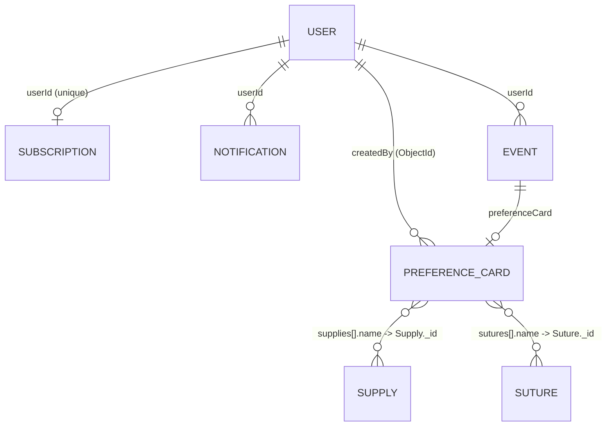

# Database Design & Relationships

Ei document ta **TBSOSICK** system er full database architecture ebong model relationships gulo describe kore. MongoDB (NoSQL) use kora hoyeche jekhane data scalability ebong performance ke priority deya hoyeche.

---

## Data Models Overview

Amader system e main collections gulo holo:

1.  **Users**: Central user management (Admin, Doctors/Users).
2.  **Preference Cards**: Doctors der surgery-specific preferences.
3.  **Subscriptions**: IAP-based (Apple/Google) billing plans + access levels.
4.  **Supplies & Sutures**: Catalog items ja preference card e embed hoy.
5.  **Events**: Calendar/surgery scheduling (optionally linked to a PrefCard).
6.  **Notifications**: In-app ebong push notification tracking.
7.  **Legal**: Admin-managed legal pages (TOS, privacy, etc).

---

## Entity Relationship Map

---

## Detailed Schema Design

### 1. User Model (`users`)
System er primary entity. Role-based access control (RBAC) eikhan theke managed hoy.
- **Fields**: `name`, `email`, `password`, `role`, `status`, `verified`, `specialty`, `hospital`, `deviceTokens`.
- **Logic**: `tokenVersion` use kora hoy token rotation ebong security-r jonno.

### 2. Preference Card Model (`preferencecards`)
Surgery workflow optimize korar jonno main data entity.
- **Relationships**:
  - `createdBy`: ObjectId — Reference to `User` (indexed).
  - `supplies[].name`: ObjectId — Reference to `Supply` (field name misleading — actually holds a Supply `_id`).
  - `sutures[].name`: ObjectId — Reference to `Suture` (same — holds a Suture `_id`).
- **Embedded Data**: `surgeon` sub-schema with `fullName`, `handPreference`, `specialty`, `contactNumber`, `musicPreference` (all required, `_id: false`).

### 3. Subscription Model (`subscriptions`)
IAP (Apple/Google) based subscription + access control. **No Stripe** — in-app purchase only.
- **Relationship**: `userId` — Reference to `User` (unique, one-sub-per-user).
- **Core fields**: `plan` (`FREE`, `PREMIUM`, `ENTERPRISE`), `status` (`active`, `trialing`, `past_due`, `canceled`, `inactive`).
- **Platform fields**: `platform` (`apple`, `google`, `admin`), `environment` (`sandbox`, `production`), `productId`, `autoRenewing`.
- **Apple fields**: `appleOriginalTransactionId` (unique + sparse — fraud prevention, blocks same Apple purchase being linked to multiple users), `appleLatestTransactionId`.
- **Google fields**: `googlePurchaseToken` (unique + sparse), `googleOrderId`.
- **Lifecycle**: `startedAt`, `currentPeriodEnd`, `gracePeriodEndsAt`, `canceledAt`, `metadata` (Mixed).

---

## Performance & Optimization

### Indexing Strategy
- **Unique Indexes**: `users.email`, `subscriptions.userId`.
- **Compound Indexes**: `PreferenceCard` e `createdBy` index kora hoyeche fast lookup er jonno.
- **Sparse Indexes**: `googleId` sparse index use kora hoyeche OAuth flexibility-r jonno.

### Query Patterns
- **Aggregation**: Doctor search flow te `PreferenceCard` ebong `Subscription` lookup kora hoy complex analytics (e.g., total cards count, active status) generate korar jonno.
- **QueryBuilder**: Standard list filtering ebong pagination er jonno [QueryBuilder](file:///src/app/builder/QueryBuilder.ts) use kora hoy.

---

---

## Detailed Schema Reference

Eikhane protiti model er fields, tader type, ebong tara required naki optional ta deya holo. Sathe relevant **Enums/Roles** o thakbe.

### 1. User Model (`users`)
System er sob users (Admin ebong Doctors) er data eikhane thake.

| Field | Type | Required | Description / Enum |
| :--- | :--- | :---: | :--- |
| `name` | String | ✅ | User er full name |
| `email` | String | ✅ | Unique, lowercase, indexed |
| `password` | String | ⚠️ | Required for non-OAuth users only (hidden via `select: false`, min 8) |
| `role` | String | ❌ | Enum `SUPER_ADMIN`, `USER` — default `USER` |
| `status` | String | ❌ | Enum `ACTIVE`, `INACTIVE`, `RESTRICTED`, `DELETE` — default `ACTIVE` |
| `verified` | Boolean | ❌ | Email verification status — default `true` |
| `country` | String | ✅ | User's country |
| `phone` | String | ✅ | Contact number |
| `location` | String | ❌ | Freeform location |
| `gender` | String | ❌ | Enum `male`, `female` |
| `dateOfBirth` | String | ❌ | DOB (stored as string) |
| `specialty` | String | ❌ | Doctor's specialty |
| `hospital` | String | ❌ | Hospital name |
| `profilePicture` | String | ❌ | URL — default placeholder |
| `about` | String | ❌ | Bio text |
| `isFirstLogin` | Boolean | ❌ | Default `true` — cleared on first successful login |
| `favoriteCards` | String[] | ❌ | Array of PreferenceCard IDs (stored as strings) |
| `deviceTokens` | String[] | ❌ | Push notification tokens (deduped via `$addToSet`) |
| `googleId` | String | ❌ | OAuth ID (sparse index — allows multiple nulls) |
| `authentication` | Object | ❌ | Hidden sub-doc: `{ isResetPassword, oneTimeCode, expireAt }` (select: false) |
| `tokenVersion`| Number | ❌ | Default `0` — incremented for token rotation / forced logout |

---

### 2. Preference Card Model (`preferencecards`)
Surgery-specific preference data.

| Field | Type | Required | Description |
| :--- | :--- | :---: | :--- |
| `createdBy` | ObjectId (ref `User`) | ✅ | Creator — indexed |
| `cardTitle` | String | ✅ | Title of the card |
| `surgeon` | Sub-doc | ✅ | Embedded `{ fullName, handPreference, specialty, contactNumber, musicPreference }` — all required, `_id: false` |
| `medication` | String | ✅ | Required medication list |
| `supplies` | `[{ name: ObjectId(Supply), quantity: Number(min 1) }]` | ✅ | Embedded array, `_id: false` — `name` is actually a Supply `_id` |
| `sutures` | `[{ name: ObjectId(Suture), quantity: Number(min 1) }]` | ✅ | Embedded array, `_id: false` — `name` is actually a Suture `_id` |
| `instruments` | String | ✅ | Instrument list / notes |
| `positioningEquipment` | String | ✅ | Positioning equipment notes |
| `prepping` | String | ✅ | Prepping notes |
| `workflow` | String | ✅ | Workflow notes |
| `keyNotes` | String | ✅ | Key notes |
| `photoLibrary` | String[] | ✅ | Image URLs |
| `downloadCount` | Number | ❌ | Default `0` |
| `published` | Boolean | ❌ | Default `false` |
| `verificationStatus` | String | ❌ | Enum `VERIFIED`, `UNVERIFIED` — default `UNVERIFIED` |

---

### 3. Subscription Model (`subscriptions`)
User access control logic.

| Field | Type | Required | Description / Enum |
| :--- | :--- | :---: | :--- |
| `userId` | ObjectId (ref `User`) | ✅ | Unique — one subscription per user |
| `plan` | String | ❌ | Enum `FREE`, `PREMIUM`, `ENTERPRISE` — default `FREE` |
| `status` | String | ❌ | Enum `active`, `trialing`, `past_due`, `canceled`, `inactive` — default `active` |
| `platform` | String | ❌ | Enum `apple`, `google`, `admin` |
| `environment` | String | ❌ | Enum `sandbox`, `production` |
| `productId` | String | ❌ | Store product ID (indexed) |
| `autoRenewing` | Boolean | ❌ | Auto-renew flag from store |
| `appleOriginalTransactionId` | String | ❌ | **Unique + sparse** — fraud guard (one Apple purchase → one user) |
| `appleLatestTransactionId` | String | ❌ | Most recent Apple txn ID |
| `googlePurchaseToken` | String | ❌ | **Unique + sparse** — Google Play purchase token |
| `googleOrderId` | String | ❌ | Google Play order ID |
| `startedAt` | Date | ❌ | Subscription start |
| `currentPeriodEnd` | Date | ❌ | Current billing period end |
| `gracePeriodEndsAt` | Date | ❌ | Grace period end (past_due) |
| `canceledAt` | Date | ❌ | Cancellation timestamp |
| `metadata` | Mixed | ❌ | Free-form store payload |

---

### 4. Notification Model (`notifications`)
In-app and push notification tracking.

> **Schema note**: `type`, `title`, `subtitle` are **not** enforced as required in the model — notification records can be created without them. Application code is expected to always supply them.

| Field | Type | Required | Description / Enum |
| :--- | :--- | :---: | :--- |
| `userId` | ObjectId (ref `User`) | ✅ | Target user |
| `type` | String | ❌ | e.g. `PREFERENCE_CARD_CREATED`, `EVENT_SCHEDULED` |
| `title` | String | ❌ | Notification header |
| `subtitle` | String | ❌ | Detailed message |
| `referenceId` | ObjectId | ❌ | Generic reference |
| `metadata` | Mixed | ❌ | Free-form payload |
| `link` | `{ label, url }` | ❌ | Optional CTA |
| `resourceType` | String | ❌ | e.g. `PreferenceCard`, `Event` |
| `resourceId` | String | ❌ | ID of the linked resource |
| `read` | Boolean | ❌ | Default `false` |
| `isDeleted` | Boolean | ❌ | Default `false` |
| `icon` | String | ❌ | Icon URL/name |
| `expiresAt` | Date | ❌ | TTL — auto-removed after this time |

**Indexes**: `{ userId: 1, read: 1, createdAt: -1 }` compound, `{ expiresAt: 1 }` TTL (`expireAfterSeconds: 0`).

---

### 5. Event Model (`events`)
Surgery or meeting scheduling.

| Field | Type | Required | Description / Enum |
| :--- | :--- | :---: | :--- |
| `userId` | ObjectId (ref `User`) | ✅ | Owner |
| `title` | String | ✅ | Event name |
| `date` | Date | ✅ | Scheduled date |
| `time` | String | ✅ | Scheduled time (stored as string) |
| `durationHours` | Number | ✅ | Duration in hours |
| `eventType` | String | ✅ | Enum `SURGERY`, `MEETING`, `CONSULTATION`, `OTHER` |
| `location` | String | ❌ | Event location |
| `preferenceCard` | ObjectId (ref `PreferenceCard`) | ❌ | Optional linked card |
| `notes` | String | ❌ | Free-form notes |
| `personnel` | `{ leadSurgeon: String, surgicalTeam: String[] }` | ❌ | Embedded sub-doc (`_id: false`) |

**Indexes**: `{ userId: 1, date: -1 }` compound.

---

### 6. Supply / Suture Models (`supplies`, `sutures`)
Shared catalog collections referenced by `PreferenceCard.supplies[].name` / `sutures[].name`.

| Field | Type | Required | Description |
| :--- | :--- | :---: | :--- |
| `name` | String | ✅ | Unique, trimmed, indexed |

*(Both models are identical — single `name` field, unique index, timestamps.)*

---

## States & Roles Explanation (Banglish)

- **User Roles**: 
  - `SUPER_ADMIN`: Full system access, doctor management, analytics.
  - `USER`: General doctor user, preference cards toiri ebong download korte pare.
- **User Status**:
  - `ACTIVE`: Normal access.
  - `RESTRICTED`: System block kore rakhle (Doctor block flow). Login korte parbe na.
  - `DELETE`: Soft-delete logic er jonno.
- **Subscription Status**:
  - `active`: Current, paid, access allowed.
  - `trialing`: Inside a trial period.
  - `past_due`: Renewal failed — in grace window (`gracePeriodEndsAt`).
  - `canceled`: User canceled, may still have access until `currentPeriodEnd`.
  - `inactive`: No access.
- **Event Types**:
  - `SURGERY`: Operation schedule.
  - `CONSULTATION`: Patient meeting.
- **Preference Card Verification**:
  - `VERIFIED`: Admin check kore verify korle (Dashboard flow).
  - `UNVERIFIED`: Naya card toiri korle default status.

---

## Implementation Reference

| Model | Path |
| :--- | :--- |
| **User** | [user.model.ts](file:///src/app/modules/user/user.model.ts) |
| **PreferenceCard** | [preference-card.model.ts](file:///src/app/modules/preference-card/preference-card.model.ts) |
| **Subscription** | [subscription.model.ts](file:///src/app/modules/subscription/subscription.model.ts) |
| **Notification** | [notification.model.ts](file:///src/app/modules/notification/notification.model.ts) |
| **Event** | [event.model.ts](file:///src/app/modules/event/event.model.ts) |
| **Supply** | [supplies.model.ts](file:///src/app/modules/supplies/supplies.model.ts) |
| **Suture** | [sutures.model.ts](file:///src/app/modules/sutures/sutures.model.ts) |
| **Legal** | [legal.model.ts](file:///src/app/modules/legal/legal.model.ts) |

---
> **Note**: Database e kono structural change korle ei doc ta update kora mandatory.
