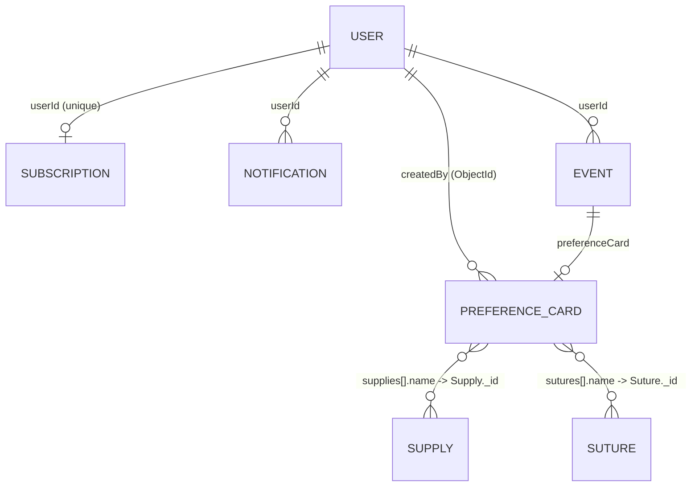

# Database Design & Relationships

Ei document ta **TBSOSICK** system er full database architecture ebong model relationships gulo describe kore. MongoDB (NoSQL) use kora hoyeche jekhane data scalability ebong performance ke priority deya hoyeche.

---

## Data Models Overview

Amader system e main collections gulo holo:

1.  **Users**: Central user management (Admin, Doctors/Users).
2.  **Preference Cards**: Doctors der surgery-specific preferences.
3.  **Subscriptions**: IAP-based (Apple/Google) billing plans + access levels.
4.  **Supplies & Sutures**: Catalog items ja preference card e embed hoy.
5.  **Events**: Calendar/surgery scheduling (optionally linked to a PrefCard).
6.  **Notifications**: In-app ebong push notification tracking.
7.  **Legal**: Admin-managed legal pages (TOS, privacy, etc).

---

## Entity Relationship Map



---

## Detailed Schema Design

### 1. User Model (`users`)
System er primary entity. Role-based access control (RBAC) eikhan theke managed hoy.
- **Fields**: `name`, `email`, `password`, `role`, `status`, `verified`, `specialty`, `hospital`, `deviceTokens`.
- **Logic**: `tokenVersion` use kora hoy token rotation ebong security-r jonno.

### 2. Preference Card Model (`preferencecards`)
Surgery workflow optimize korar jonno main data entity.
- **Relationships**:
  - `createdBy`: ObjectId — Reference to `User` (indexed).
  - `supplies[].name`: ObjectId — Reference to `Supply` (field name misleading — actually holds a Supply `_id`).
  - `sutures[].name`: ObjectId — Reference to `Suture` (same — holds a Suture `_id`).
- **Embedded Data**: `surgeon` sub-schema with `fullName`, `handPreference`, `specialty`, `contactNumber`, `musicPreference` (all required, `_id: false`).

### 3. Subscription Model (`subscriptions`)
IAP (Apple/Google) based subscription + access control. **No Stripe** — in-app purchase only.
- **Relationship**: `userId` — Reference to `User` (unique, one-sub-per-user).
- **Core fields**: `plan` (`FREE`, `PREMIUM`, `ENTERPRISE`), `status` (`active`, `trialing`, `past_due`, `canceled`, `inactive`).
- **Platform fields**: `platform` (`apple`, `google`, `admin`), `environment` (`sandbox`, `production`), `productId`, `autoRenewing`.
- **Apple fields**: `appleOriginalTransactionId` (unique + sparse — fraud prevention, blocks same Apple purchase being linked to multiple users), `appleLatestTransactionId`.
- **Google fields**: `googlePurchaseToken` (unique + sparse), `googleOrderId`.
- **Lifecycle**: `startedAt`, `currentPeriodEnd`, `gracePeriodEndsAt`, `canceledAt`, `metadata` (Mixed).

---

## Performance & Optimization

### Indexing Strategy
- **Unique Indexes**: `users.email`, `subscriptions.userId`.
- **Compound Indexes**: `PreferenceCard` e `createdBy` index kora hoyeche fast lookup er jonno.
- **Sparse Indexes**: `googleId` sparse index use kora hoyeche OAuth flexibility-r jonno.

### Query Patterns
- **Aggregation**: Doctor search flow te `PreferenceCard` ebong `Subscription` lookup kora hoy complex analytics (e.g., total cards count, active status) generate korar jonno.
- **QueryBuilder**: Standard list filtering ebong pagination er jonno [QueryBuilder](file:///src/app/builder/QueryBuilder.ts) use kora hoy.

---

---

## Detailed Schema Reference

Eikhane protiti model er fields, tader type, ebong tara required naki optional ta deya holo. Sathe relevant **Enums/Roles** o thakbe.

### 1. User Model (`users`)
System er sob users (Admin ebong Doctors) er data eikhane thake.

| Field | Type | Required | Description / Enum |
| :--- | :--- | :---: | :--- |
| `name` | String | ✅ | User er full name |
| `email` | String | ✅ | Unique, lowercase, indexed |
| `password` | String | ⚠️ | Required for non-OAuth users only (hidden via `select: false`, min 8) |
| `role` | String | ❌ | Enum `SUPER_ADMIN`, `USER` — default `USER` |
| `status` | String | ❌ | Enum `ACTIVE`, `INACTIVE`, `RESTRICTED`, `DELETE` — default `ACTIVE` |
| `verified` | Boolean | ❌ | Email verification status — default **`false`** (flipped to `true` only after OTP verification) |
| `country` | String | ✅ | User's country |
| `phone` | String | ✅ | Contact number |
| `location` | String | ❌ | Freeform location |
| `gender` | String | ❌ | Enum `male`, `female` |
| `dateOfBirth` | String | ❌ | DOB (stored as string) |
| `specialty` | String | ❌ | Doctor's specialty |
| `hospital` | String | ❌ | Hospital name |
| `profilePicture` | String | ❌ | URL — default placeholder |
| `about` | String | ❌ | Bio text |
| `isFirstLogin` | Boolean | ❌ | Default `true` — cleared on first successful login |
| `deviceTokens` | Sub-doc[] | ❌ | Array of `{ token, platform, appVersion, lastSeenAt }` — upsert refreshes `lastSeenAt` instead of duplicating. *Favorites moved to a separate collection — see §7.* |
| `googleId` | String | ❌ | OAuth ID (sparse index — allows multiple nulls) |
| `authentication` | Object | ❌ | Hidden sub-doc: `{ isResetPassword, oneTimeCode, expireAt }` (select: false) |
| `tokenVersion`| Number | ❌ | Default `0`, **`select: false`** — incremented on refresh / reset-password to invalidate old JWTs |

---

### 2. Preference Card Model (`preferencecards`)
Surgery-specific preference data.

| Field | Type | Required | Description |
| :--- | :--- | :---: | :--- |
| `createdBy` | ObjectId (ref `User`) | ✅ | Creator — indexed |
| `cardTitle` | String | ✅ | Title of the card |
| `surgeon` | Sub-doc | ✅ | Embedded `{ fullName, handPreference, specialty, contactNumber, musicPreference }` — all required, `_id: false` |
| `medication` | String | ✅ | Required medication list |
| `supplies` | `[{ supply: ObjectId(Supply), quantity: Number(min 1) }]` | ✅ | Embedded array, `_id: false` — FK field renamed from `name` → `supply` so the field name matches what it actually holds |
| `sutures` | `[{ suture: ObjectId(Suture), quantity: Number(min 1) }]` | ✅ | Embedded array, `_id: false` — FK field renamed from `name` → `suture` |
| `instruments` | String | ✅ | Instrument list / notes |
| `positioningEquipment` | String | ✅ | Positioning equipment notes |
| `prepping` | String | ✅ | Prepping notes |
| `workflow` | String | ✅ | Workflow notes |
| `keyNotes` | String | ✅ | Key notes |
| `photoLibrary` | String[] | ✅ | Image URLs |
| `downloadCount` | Number | ❌ | Default `0` |
| `published` | Boolean | ❌ | Default `false` |
| `verificationStatus` | String | ❌ | Enum `VERIFIED`, `UNVERIFIED` — default `UNVERIFIED` |

---

### 3. Subscription Model (`subscriptions`)
User access control logic.

| Field | Type | Required | Description / Enum |
| :--- | :--- | :---: | :--- |
| `userId` | ObjectId (ref `User`) | ✅ | Unique — one subscription per user |
| `plan` | String | ❌ | Enum `FREE`, `PREMIUM`, `ENTERPRISE` — default `FREE` |
| `status` | String | ✅ | Enum `active`, `trialing`, `past_due`, `canceled`, `inactive` — **no default** (must be explicitly set after a verified purchase or admin grant) |
| `platform` | String | ❌ | Enum `apple`, `google`, `admin` |
| `environment` | String | ❌ | Enum `sandbox`, `production` |
| `productId` | String | ❌ | Store product ID (indexed) |
| `autoRenewing` | Boolean | ❌ | Auto-renew flag from store |
| `appleOriginalTransactionId` | String | ❌ | **Unique + sparse** — fraud guard (one Apple purchase → one user) |
| `appleLatestTransactionId` | String | ❌ | Most recent Apple txn ID |
| `googlePurchaseToken` | String | ❌ | **Unique + sparse** — Google Play purchase token |
| `googleOrderId` | String | ❌ | Google Play order ID |
| `startedAt` | Date | ❌ | Subscription start |
| `currentPeriodEnd` | Date | ❌ | Current billing period end |
| `gracePeriodEndsAt` | Date | ❌ | Grace period end (past_due) |
| `canceledAt` | Date | ❌ | Cancellation timestamp |
| `metadata` | Mixed | ❌ | Free-form store payload |

---

### 4. Notification Model (`notifications`)
In-app and push notification tracking.

> **Schema note**: `type` and `title` are **required** (schema-enforced). `type` is constrained to a fixed enum so typos fail at insert time. The polymorphic reference is `{ resourceType, resourceId }` — the older `referenceId` field has been removed.

| Field | Type | Required | Description / Enum |
| :--- | :--- | :---: | :--- |
| `userId` | ObjectId (ref `User`) | ✅ | Target user |
| `type` | String | ✅ | Enum `PREFERENCE_CARD_CREATED`, `EVENT_SCHEDULED`, `GENERAL`, `ADMIN`, `SYSTEM`, `MESSAGE`, `REMINDER` |
| `title` | String | ✅ | Notification header |
| `subtitle` | String | ❌ | Detailed message |
| `resourceType` | String | ❌ | Owning model tag, e.g. `PreferenceCard`, `Event`, `User` |
| `resourceId` | String | ❌ | ID of the linked resource (string — supports slugs and ObjectIds) |
| `link` | `{ label, url }` | ❌ | Optional CTA |
| `metadata` | Mixed | ❌ | Free-form payload |
| `read` | Boolean | ❌ | Default `false` |
| `isDeleted` | Boolean | ❌ | Default `false` |
| `icon` | String | ❌ | Icon URL/name |
| `expiresAt` | Date | ❌ | TTL — auto-removed after this time |

**Indexes**: `{ userId: 1, read: 1, createdAt: -1 }` compound, `{ expiresAt: 1 }` TTL (`expireAfterSeconds: 0`), `{ resourceType: 1, resourceId: 1 }` compound.

---

### 5. Event Model (`events`)
Surgery or meeting scheduling.

| Field | Type | Required | Description / Enum |
| :--- | :--- | :---: | :--- |
| `userId` | ObjectId (ref `User`) | ✅ | Owner |
| `title` | String | ✅ | Event name |
| `startsAt` | Date | ✅ | Event start (full ISO timestamp) |
| `endsAt` | Date | ✅ | Event end (full ISO timestamp) — validated `> startsAt` |
| `eventType` | String | ✅ | Enum `SURGERY`, `MEETING`, `CONSULTATION`, `OTHER` |
| `location` | String | ❌ | Event location |
| `preferenceCard` | ObjectId (ref `PreferenceCard`) | ❌ | Optional linked card |
| `notes` | String | ❌ | Free-form notes |
| `personnel` | `{ leadSurgeon: String, surgicalTeam: String[] }` | ❌ | Embedded sub-doc (`_id: false`) |

**Indexes**: `{ userId: 1, startsAt: 1 }` compound.

> **Client compat**: the HTTP contract still accepts the legacy `{ date, time, durationHours }` triple. The service layer normalises it into `{ startsAt, endsAt }` before writing, so the DB only ever sees the new shape.

---

### 6. Supply / Suture Models (`supplies`, `sutures`)
Shared catalog collections referenced by `PreferenceCard.supplies[].supply` / `sutures[].suture`.

| Field | Type | Required | Description |
| :--- | :--- | :---: | :--- |
| `name` | String | ✅ | Unique, trimmed, indexed |
| `category` | String | ❌ | Catalog category (indexed) |
| `unit` | String | ❌ | Unit of measure (e.g. `pcs`, `box`) |
| `manufacturer` | String | ❌ | Manufacturer name |
| `isActive` | Boolean | ❌ | Default `true` — soft-deprecate items without orphaning embedded refs in historical cards (indexed) |
| `createdBy` | ObjectId (ref `User`) | ❌ | Auditor: who added this catalog entry |

*(Both models share the same shape.)*

---

### 7. Favorite Model (`favorites`)
Join table between users and favorited preference cards. Replaces the previous `User.favoriteCards: [String]` array.

| Field | Type | Required | Description |
| :--- | :--- | :---: | :--- |
| `userId` | ObjectId (ref `User`) | ✅ | Favoriter |
| `cardId` | ObjectId (ref `PreferenceCard`) | ✅ | Favorited card |
| `createdAt` | Date | ✅ | Auto — when the card was favorited |

**Indexes**: `{ userId, cardId }` unique (makes favorite toggling idempotent), standalone `userId` and `cardId` indexes.

---

### 8. SubscriptionEvent Model (`subscriptionevents`)
Append-only audit log for `subscriptions`. Written by the `Subscription.upsertForUser` static whenever plan or status changes.

| Field | Type | Required | Description |
| :--- | :--- | :---: | :--- |
| `userId` | ObjectId (ref `User`) | ✅ | Owning user |
| `subscriptionId` | ObjectId (ref `Subscription`) | ✅ | The current-state row this event mutated |
| `eventType` | String | ✅ | Enum `CREATED`, `UPGRADED`, `DOWNGRADED`, `RENEWED`, `CANCELED`, `EXPIRED`, `REFUNDED`, `GRACE_STARTED`, `GRACE_RESOLVED`, `STATUS_CHANGED`, `PLAN_CHANGED` |
| `previousPlan` / `nextPlan` | String | ❌ | Plan snapshot before/after |
| `previousStatus` / `nextStatus` | String | ❌ | Status snapshot before/after |
| `platform` | String | ❌ | Enum `apple`, `google`, `admin` |
| `productId` | String | ❌ | Store product ID at time of event |
| `externalTransactionId` | String | ❌ | Apple/Google transaction or order id — for webhook correlation |
| `metadata` | Mixed | ❌ | Raw store payload |
| `occurredAt` | Date | ✅ | Real-world timestamp of the transition |

**Indexes**: `userId`, `subscriptionId`, `eventType`, `externalTransactionId` single-field, plus `{ userId, occurredAt: -1 }` compound for history queries.

---

## States & Roles Explanation (Banglish)

- **User Roles**: 
  - `SUPER_ADMIN`: Full system access, doctor management, analytics.
  - `USER`: General doctor user, preference cards toiri ebong download korte pare.
- **User Status**:
  - `ACTIVE`: Normal access.
  - `RESTRICTED`: System block kore rakhle (Doctor block flow). Login korte parbe na.
  - `DELETE`: Soft-delete logic er jonno.
- **Subscription Status**:
  - `active`: Current, paid, access allowed.
  - `trialing`: Inside a trial period.
  - `past_due`: Renewal failed — in grace window (`gracePeriodEndsAt`).
  - `canceled`: User canceled, may still have access until `currentPeriodEnd`.
  - `inactive`: No access.
- **Event Types**:
  - `SURGERY`: Operation schedule.
  - `CONSULTATION`: Patient meeting.
- **Preference Card Verification**:
  - `VERIFIED`: Admin check kore verify korle (Dashboard flow).
  - `UNVERIFIED`: Naya card toiri korle default status.

---

## Implementation Reference

| Model | Path |
| :--- | :--- |
| **User** | [user.model.ts](file:///src/app/modules/user/user.model.ts) |
| **PreferenceCard** | [preference-card.model.ts](file:///src/app/modules/preference-card/preference-card.model.ts) |
| **Subscription** | [subscription.model.ts](file:///src/app/modules/subscription/subscription.model.ts) |
| **SubscriptionEvent** | [subscription-event.model.ts](file:///src/app/modules/subscription/subscription-event.model.ts) |
| **Notification** | [notification.model.ts](file:///src/app/modules/notification/notification.model.ts) |
| **Event** | [event.model.ts](file:///src/app/modules/event/event.model.ts) |
| **Favorite** | [favorite.model.ts](file:///src/app/modules/favorite/favorite.model.ts) |
| **Supply** | [supplies.model.ts](file:///src/app/modules/supplies/supplies.model.ts) |
| **Suture** | [sutures.model.ts](file:///src/app/modules/sutures/sutures.model.ts) |
| **Legal** | [legal.model.ts](file:///src/app/modules/legal/legal.model.ts) |

---

## 📚 Design Fixes — What Was Wrong, Why It Was a Problem, How It Was Fixed

Ei section ta ekta learning log. Proti ti fix-er against-e amra rakhsi:
- **Ki chilo** — kivabe schema ta originally likha chilo.
- **Keno eta problem chilo** — real world-e ei design kon jaygay bite korto.
- **Kibhabe fix hoyeche** — ki change hoyeche (files + shape).
- **Impact** — kono migration ba API contract change ache kina.

Eta shudhu history noy — ei patterns future schema decisions guide korbe, tai obossho porte hobe schema change korar age.

---

### Fix 1 — `User.favoriteCards` ke alada collection banano hoyeche

**Ki chilo**
User model-er moddhe `favoriteCards: [String]` — raw string array. Favorite kore dile user document-e cardId push hoto, unfavorite korle `$pull`.

**Keno eta problem chilo**
- **Unbounded array anti-pattern** — power user jodi 5k card favorite kore, protyek user read-e (profile fetch, auth check, me endpoint, populate chain) shei 5k string payload ashto. Mongo document-er 16MB limit to onek dure, kintu working-set memory + network bandwidth age kharap hoto.
- **Referential integrity nei** — `String`-e store korar karone Mongoose `populate()` kaj korto na, orphan detection o kora jeto na. Ekta card delete hole user-er `favoriteCards` e dead ID remnant thakto.
- **Pagination kora imposible** — "latest 20 favorites" query korte hole whole array load kore in-memory slice korte hoto.
- **Index useless** — array element guloke real index dewa jeto na.

**Kibhabe fix hoyeche**
Notun collection `favorites` — `{ userId: ObjectId ref User, cardId: ObjectId ref PreferenceCard, createdAt }`. Ekta unique compound index `{ userId, cardId }` diye favorite idempotent kora hoyeche (double click hole duplicate insert hobe na). User model theke `favoriteCards` field fully remove kora hoyeche.

Service layer-e:
- `favoritePreferenceCardInDB` ekhon `Favorite.updateOne({ userId, cardId }, { $setOnInsert }, { upsert: true })` kore.
- `unfavoritePreferenceCardInDB` ekhon `Favorite.deleteOne()` kore.
- `listFavoritePreferenceCardsForUserFromDB` first `Favorite` collection theke cardIds nite, then `PreferenceCard.find({ _id: { $in } })` kore — this lets QueryBuilder handle pagination on the actual cards, which is what users want.

**Files touched**
- NEW: `src/app/modules/favorite/favorite.model.ts`, `favorite.interface.ts`
- `src/app/modules/user/user.model.ts`, `user.interface.ts` — field removed
- `src/app/modules/preference-card/preference-card.service.ts` — all favorite ops rewritten

**Migration note**
Jodi production DB-te purono `user.favoriteCards` data thake, ekta one-off backfill script likhe `Favorite` collection-e copy kore dite hobe. Shei script ekhono likha hoy nai — data existence check koro first.

---

### Fix 2 — `User.deviceTokens` ke sub-document array banano hoyeche

**Ki chilo**
`deviceTokens: [String]` — ekta flat token string array, `$addToSet` diye dedupe.

**Keno eta problem chilo**
- **Metadata nei** — ekta token kon platform-er (iOS/Android/web), kon app version-e register hoyechilo, last kokhon active chilo — kichu jana jeto na.
- **Stale token prune hoy na** — Apple/Google token rotate kore, kintu purono token DB-te chup kore bose thakto. Push delivery success rate slowly decay korto without any visible signal.
- **Dedupe shudhu string-level** — same physical device theke new token ashle old ta rekhe new ta add hoto, resulting in multiple live tokens per device.

**Kibhabe fix hoyeche**
`deviceTokens` ekhon sub-document array: `[{ token, platform, appVersion, lastSeenAt }]` with `_id: false` (no sub-doc id overhead).

Static methods rewritten:
- `addDeviceToken(userId, token, platform?, appVersion?)` — first `$set` try kore existing sub-doc-er `lastSeenAt` + metadata update kore (ekta atomic `{ _id, 'deviceTokens.token': token }` filter diye positional `$`). Not found hole notun sub-doc `$push` kore. Result: **no duplicates**, metadata always fresh.
- `removeDeviceToken(userId, token)` — `$pull: { deviceTokens: { token } }` — match the sub-doc by token field instead of whole value.

**Files touched**
- `src/app/modules/user/user.model.ts`, `user.interface.ts` — schema + types
- `src/app/builder/NotificationBuilder/channels/push.channel.ts` — now reads `entry.token` from each sub-doc
- `src/app/modules/notification/notificationsHelper.ts` — same — maps to token strings
- `src/app/builder/NotificationBuilder/NotificationBuilder.ts` — internal `IUser` interface updated

**Migration note**
Purono flat-string data with the new schema-e read korle Mongoose will return strings instead of `{ token }` objects — push channels will silently skip them. Ekta one-off migration: `db.users.updateMany({}, [{ $set: { deviceTokens: { $map: { input: '$deviceTokens', as: 't', in: { token: '$$t' } } } } }])`.

---

### Fix 3 — `PreferenceCard.supplies[].name` → `supplies[].supply` (suture equally)

**Ki chilo**
Sub-document field-er naam `name`, kintu value actually `Supply._id` (ObjectId FK). Sutures-e same: `sutures[].name` holding Suture FK.

**Keno eta problem chilo**
- **Reader trap** — reviewer, future dev, ba API consumer code porle eta dekhe bhabbe "name stores the supply's display name." Eta bhul assumption generate korto debug time-e.
- **Populate paths misleading** — `populate('supplies.name', 'name -_id')` — same word-ta two different kaaj-er jonno use hocche (field path AND projection field). Painful to read.
- **Type safety leak** — TypeScript interface `name: Types.ObjectId` — naming + typing mismatched, linting eta catch korte parto na.

**Kibhabe fix hoyeche**
Field-er nam-ei meaning-er sathe match kora hoyeche:
- Supply item: `{ supply: ObjectId(Supply), quantity: Number }`
- Suture item: `{ suture: ObjectId(Suture), quantity: Number }`

API contract (client-facing JSON) ekhono `{ name, quantity }` deya hoy — **backwards compat preserved**. Service layer-e ekta `normaliseClientRefField` helper kaj kore: incoming payload-er `name` ke internally `supply`/`suture`-e rename kore schema-er sathe match korate.

Populate paths update:
- `populate('supplies.supply', 'name -_id')` — now the path says "fetch the Supply doc and return its `name` field."
- Response flattening-o (`flattenCard`) updated to read `item.supply?.name` instead of `item.name?.name`.

**Files touched**
- `src/app/modules/preference-card/preference-card.interface.ts` — type renames
- `src/app/modules/preference-card/preference-card.model.ts` — schema field rename
- `src/app/modules/preference-card/preference-card.service.ts` — resolver, populate paths, flatten, create + update helpers

**Migration note**
MongoDB-te alreadi existing docs-er moddhe sub-doc key `name` thakbe. Ekta `$rename` migration dorkar:
```js
db.preferencecards.updateMany(
  { 'supplies.0': { $exists: true } },
  [{ $set: { supplies: { $map: { input: '$supplies', as: 'it', in: { supply: '$$it.name', quantity: '$$it.quantity' } } } } }]
);
// similarly for sutures
```

---

### Fix 4 — `Supply` / `Suture` ke catalog model hisebe beef up kora hoyeche

**Ki chilo**
Dui model-ei shudhu ekta field: `name: String`.

**Keno eta problem chilo**
- **Deprecate kora impossible** — ekta item obsolete hole, delete korle embedded ObjectId refs (historical preference cards-e) orphan hoye jeto. Shei historical data render korar sokti haraoto. Soft-delete path nei.
- **Catalog metadata nei** — category (e.g. "Gauze", "Syringe"), unit of measure, manufacturer, createdBy — kichui track hoyi na. "Show me all Ethicon sutures" type query impossible.
- **Audit trail nei** — ke catalog entry add korchilo, kokhon — kichu jana jay na.

**Kibhabe fix hoyeche**
Field set extended:
- `category: String` (indexed) — grouping for facet UIs
- `unit: String` — e.g. `"pcs"`, `"box"`, `"strand"`
- `manufacturer: String`
- `isActive: Boolean` (default `true`, indexed) — **soft-deprecate path**: set `false` → item hides from new card creation, but historical cards still render via populate
- `createdBy: ObjectId(User)` — audit who added it

**Files touched**
- `src/app/modules/supplies/supplies.interface.ts`, `supplies.model.ts`
- `src/app/modules/sutures/sutures.interface.ts`, `sutures.model.ts`

**Migration note**
All existing docs get `isActive: true` on next read via mongoose default — no backfill needed unless you want to deprecate specific items immediately.

---

### Fix 5 — `Event.time` + `durationHours` → `startsAt` + `endsAt` Date pair

**Ki chilo**
`Event` model-e three separate fields: `date: Date`, `time: String` (e.g. `"14:30"`), `durationHours: Number`. Start timestamp construct korte hole code-e runtime-e `new Date(\`${date}T${time}:00Z\`)` parse korte hoto.

**Keno eta problem chilo**
- **Timezone unsafe** — `time` string tells nothing about offset. Server-e `date` is a UTC Date, but `time` string gets appended with hardcoded `Z`, which makes every event silently UTC regardless of user intent.
- **"Ei muhurte kon event chalche?" query kaj korto na** — MongoDB filter `$lte: now, $gte: now` run korte hole combined timestamp lagto, jeta `date + time` e ekta index-able field na.
- **Calendar range queries inefficient** — index shudhu `{ userId, date }` diye chilo, kintu practical calendar view-e duration cross korte hoy day boundary, so just `date` compare korle edge events miss hoto.
- **Data integrity nei** — `durationHours` negative dile, ba `time` bad format dile, schema level-e kichu catch hoto na (service-e regex check chilo).

**Kibhabe fix hoyeche**
Schema-te duita Date field:
- `startsAt: Date` (required)
- `endsAt: Date` (required, validated `> startsAt` in service)

Calendar query-gulo ekhon natural:
```js
{ userId, startsAt: { $gte: from, $lte: to } }
```

Compound index `{ userId: 1, startsAt: 1 }` updated. Legacy index dropped.

**Backwards compat**: HTTP API ekhono accept kore `{ date, time, durationHours }` triple — validation schema-e optional, service-e `resolveTimeRange()` helper both input shapes-ke ekta `{ startsAt, endsAt }` e normalise kore. So mobile clients break hobe na until they migrate.

**Files touched**
- `src/app/modules/event/event.interface.ts`, `event.model.ts`, `event.service.ts`, `event.validation.ts`

**Migration note**
```js
db.events.find({ date: { $exists: true }, time: { $type: 'string' } }).forEach(doc => {
  const startsAt = new Date(doc.date.toISOString().slice(0, 10) + 'T' + doc.time + ':00.000Z');
  const endsAt = new Date(startsAt.getTime() + (doc.durationHours || 1) * 3600000);
  db.events.updateOne(
    { _id: doc._id },
    { $set: { startsAt, endsAt }, $unset: { date: '', time: '', durationHours: '' } }
  );
});
```

---

### Fix 6 — `SubscriptionEvent` audit collection add kora hoyeche

**Ki chilo**
`Subscription` model-e `userId: unique: true` — mane protyek user-er ekta row only. `upsertForUser` call-e `findOneAndUpdate({ userId }, ...)` directly current state overwrite korto. Koi ghonta age user PREMIUM chilo naki FREE — kono way chilo na bolar.

**Keno eta problem chilo**
- **Refund dispute blind** — "ei user last week PREMIUM chilo" claim verify kora jabe na.
- **Abuse detection broken** — ekta user multiple times status flip korle pattern detect kora kothin.
- **Churn analytics impossible** — cancellation reasoning, downgrade timing, trial-to-paid conversion — shob current-state read theke infer korte hobe.
- **Webhook replay safety weak** — Apple/Google webhook duplicate deliver korle, idempotency ensure korar jonno kono event history chilo na.

**Kibhabe fix hoyeche**
Notun collection `subscriptionevents` — append-only. `Subscription.upsertForUser` ekhon first purono state `lean()` diye fetch kore, then upsert kore, then diff kore:
- First time? → `CREATED` event write.
- Plan changed? → `PLAN_CHANGED` event.
- Status changed? → `STATUS_CHANGED` event.

Each event captures `{ previousPlan, nextPlan, previousStatus, nextStatus, platform, productId, externalTransactionId, occurredAt }`. `externalTransactionId` gives replay-safety — webhook re-delivery case-e same txn id diye duplicate detect kora jabe (future enhancement).

Audit writes are wrapped in try/catch: if the audit write fails, the primary subscription update still succeeds (audit should never block the critical path).

**Files touched**
- NEW: `src/app/modules/subscription/subscription-event.model.ts`, `subscription-event.interface.ts`
- `src/app/modules/subscription/subscription.model.ts` — `upsertForUser` static now writes audit events

**Future work**
Currently covers `CREATED`, `PLAN_CHANGED`, `STATUS_CHANGED`. Richer event types (`REFUNDED`, `GRACE_STARTED`, `RENEWED`) should be emitted from the store webhook handlers directly, not inferred from diff.

---

### Fix 7 — `Subscription.status` default removed

**Ki chilo**
Schema-te `status: { default: 'active' }`. Mane ekta partial upsert payload-e `status` field na thakleo, newly-created row `active` hoye jeto. Doc-o false-advertise korto.

**Keno eta problem chilo**
Purchase verify flow crash holeo, ekta bare `Subscription({ userId })` create hoe jete parto (upstream code bug, network blip, etc.) — shei user peye jeto free `active` access without any receipt. This is a **privilege escalation risk**.

**Kibhabe fix hoyeche**
`status: { required: true }` — no default. Schema validation ekhon explicit `status` value chai insert-time. All existing callers (`ensureSubscriptionDoc`, `setFreePlan`, `verifyApplePurchase`, `verifyGooglePurchase`) already pass status explicitly, verified via grep — **no runtime break**.

**Files touched**
- `src/app/modules/subscription/subscription.model.ts`

---

### Fix 8 — `User.verified` default changed `true` → `false`, signup triggers OTP

**Ki chilo**
- Schema-te `verified: { default: true }`.
- `user.service.createUserToDB` explicit `{ ...payload, verified: true }` pass korto — double safeguard bypass.
- Result: naya user create holei verified, OTP flow practically dead code.

**Keno eta problem chilo**
- Email verification infrastructure (`sendVerificationOTP`, `/auth/verify-otp`, `/auth/resend-verify-email`) existed but was **architecturally unreachable** from the normal signup path.
- Fake/stolen email diye account create kora jeto without proof of email ownership.
- `auth.service.loginUserFromDB` te `if (!isExistUser.verified) throw` guard chilo but never fired.

**Kibhabe fix hoyeche**
- Schema default flipped to `false`.
- `createUserToDB` theke `verified: true` override removed.
- Signup-er pore `sendVerificationOTP(createUser.email)` fire-and-forget call — OTP email chole jabe, user code enter korle `/auth/verify-otp` flip korbe `verified: true`. Email send fail hole signup still succeeds; user can request resend.

**Files touched**
- `src/app/modules/user/user.model.ts`
- `src/app/modules/user/user.service.ts`

**Behavior change warning**
Ei fix ta **user-visible behavior change**. Jodi product team intentionally OTP bypass korchilo (fast signup, ad campaign, etc.), ei change revert korte hobe OR business flow update korte hobe. Doc-e flag kora — rollout plan lagbe.

---

### Fix 9 — `User.tokenVersion` → `select: false`

**Ki chilo**
`tokenVersion: { default: 0 }` — schema-e visible by default. Protyek `User.findOne()`, `findById()`, list query — shob kichutei tokenVersion chole ashto.

**Keno eta problem chilo**
- **Pollution** — admin list, profile fetch, even populate-er joined user docs — everywhere tokenVersion leaking. Small but constant bandwidth waste + larger response size.
- **Leaks internal invariant** — tokenVersion ekta security counter; ota clients-ke dekhate hobe na. Intent is internal to JWT rotation.

**Kibhabe fix hoyeche**
`select: false` on the schema field. Ekhon default-ei hide. Jodi kono code path-er `tokenVersion` chai (login, verify-otp, refresh-token), explicit `.select('+tokenVersion')` ba `.select('+password +tokenVersion')` diye fetch korte hobe.

Call sites updated:
- `loginUserFromDB` — now `.select('+password +tokenVersion')`
- `verifyEmailToDB` — now `.select('+authentication +tokenVersion')`
- `refreshTokenToDB` — now `.select('+tokenVersion')`

Write paths (`$inc: { tokenVersion: 1 }`) don't need the select — Mongo `$inc` works regardless of projection.

**Files touched**
- `src/app/modules/user/user.model.ts` — schema
- `src/app/modules/auth/auth.service.ts` — 3 call sites

---

### Fix 10 — Notification polymorphic reference consolidated: `{ resourceType, resourceId }` only

**Ki chilo**
Notification schema-te **three** overlapping fields: `referenceId: ObjectId`, `resourceType: String`, `resourceId: String`. Use cases mixed — some code paths used `referenceId`, others used `resourceType`/`resourceId`. No invariant.

**Keno eta problem chilo**
- **Inconsistent reads** — ekta caller read korche `referenceId`, arekta `resourceId` — kon ta active? Both? Depends on writer. Trap for reviewers.
- **No join semantics** — `referenceId` ObjectId ekta diye kono way nei bola "ei ObjectId kon collection-er?" Polymorphic link hole `resourceType` obossho dorkar.
- **Dual write risk** — writer-ra konodino confused hoye both set korto, readers then mishandle.

**Kibhabe fix hoyeche**
- `referenceId` field **fully removed** from `Notification` schema.
- `{ resourceType, resourceId }` is the only polymorphic ref. `resourceId` is `String` (not `ObjectId`) so it can hold slugs, order numbers, or ObjectId strings — caller decides.
- `NotificationBuilder.setReference(id)` method **removed**, replaced with `setResource(type, id)` — force the caller to tag the type.
- `ScheduledNotification` model aligned — `referenceId` removed, `resourceType`/`resourceId` added.
- `scheduler.service.processSingle` updated to replay with `setResource`.
- `database.channel.saveToDatabase` writes both fields from `content.resourceType` + `content.resourceId`.
- Compound index `{ resourceType: 1, resourceId: 1 }` added — enables "show all notifications about this entity" queries.

**Files touched**
- `src/app/modules/notification/notification.interface.ts`, `notification.model.ts`
- `src/app/builder/NotificationBuilder/NotificationBuilder.ts` — content shape + builder API
- `src/app/builder/NotificationBuilder/channels/database.channel.ts`
- `src/app/builder/NotificationBuilder/scheduler/ScheduledNotification.model.ts`
- `src/app/builder/NotificationBuilder/scheduler/scheduler.service.ts`
- `src/app/modules/event/event.service.ts` — scheduler reminders now use `.setResource('Event', eventId)`

**Migration note**
Purono notification docs with `referenceId` set will **lose** that data on read (field dropped from schema = Mongoose will not project it). Backfill script if historical references matter:
```js
db.notifications.updateMany(
  { referenceId: { $exists: true }, resourceId: { $exists: false } },
  [{ $set: { resourceId: { $toString: '$referenceId' } } }]
);
db.notifications.updateMany({}, { $unset: { referenceId: '' } });
```

---

### Fix 11 — Notification `type` + `title` now required + narrowed enum

**Ki chilo**
Schema-te `type` and `title` both optional strings. Application layer "trusted" to always supply them. `type` field-er kono enum constraint chilo na — any string accepted.

**Keno eta problem chilo**
- **Silent bad data** — ekta caller ekta typo `type: 'EVENT_SCHEDULD'` likhle insert succeed kore. Frontend code jeta enum-match filter kore, mysteriously notifications miss kore.
- **No invariant** — "protyek notification has a title" — eta application-level expectation chilo, schema-te enforced chilo na. New contributor chaile title-less notification create korte parto.
- **Mixed dumping ground** — same collection marketplace (`BID`, `BID_ACCEPTED`, `BOOKING`, `DELIVERY_SUBMITTED`, etc.) + medical (`PREFERENCE_CARD_CREATED`, `EVENT_SCHEDULED`) notification type define kortechilo. Code dead era, marketplace notifs have never fired in this project.

**Kibhabe fix hoyeche**
- `type` and `title` now `required: true` at schema level.
- `type` field constrained to enum `NOTIFICATION_TYPES = ['PREFERENCE_CARD_CREATED', 'EVENT_SCHEDULED', 'GENERAL', 'ADMIN', 'SYSTEM', 'MESSAGE', 'REMINDER']`.
- Dead marketplace types (`BID`, `BID_ACCEPTED`, `BOOKING`, `TASK`, `DELIVERY_SUBMITTED`, `PAYMENT_PENDING`, `ORDER`, `PAYMENT`) **removed** from both `NotificationType` union (builder) and the enum in `ScheduledNotification`.
- Builder's content resolver already falls back to `title: 'Notification'` and `type: 'SYSTEM'` if manual content omits them, so existing call sites are safe.

**Files touched**
- `src/app/modules/notification/notification.interface.ts` — exported `NOTIFICATION_TYPES` + type constraint
- `src/app/modules/notification/notification.model.ts` — required + enum
- `src/app/builder/NotificationBuilder/NotificationBuilder.ts` — narrowed `NotificationType` union
- `src/app/builder/NotificationBuilder/scheduler/ScheduledNotification.model.ts` — enum narrowed

**Audit finding** (bonus)
During this refactor a pre-existing broken call was found and fixed: `user.controller.getFavoriteCards` called `PreferenceCardService.getFavoriteCardIdsForUser` — this function did not exist (correct name: `getFavoriteCardIdsForUserFromDB`). The favorites endpoint would have thrown on every request. Renamed to correct function name in `user.controller.ts`.

---

## 🧩 Summary Table — Tier 2 Fixes Applied

| # | Issue | Core change | Files touched |
| :---: | :--- | :--- | :---: |
| 8 | `favoriteCards` array anti-pattern | New `Favorite` collection | 5 |
| 9 | `deviceTokens` no metadata | Sub-doc with `{ token, platform, appVersion, lastSeenAt }` | 5 |
| 10 | `supplies.name` field-name lie | Renamed to `supplies.supply` / `sutures.suture` | 3 |
| 11 | `Supply` / `Suture` underbuilt | Added category, unit, manufacturer, isActive, createdBy | 4 |
| 12 | `Event.time: String` broken | Replaced with `startsAt` / `endsAt` Date pair + legacy compat | 4 |
| 13 | `Subscription` no history | New `SubscriptionEvent` audit collection + hook in `upsertForUser` | 3 |
| 14 | `Subscription.status` default `active` | Default removed, now required | 1 |
| 15 | `User.verified` default `true` | Default flipped to `false`, OTP triggered on signup | 2 |
| 16 | `User.tokenVersion` leaked | `select: false`, explicit pulls in auth paths | 2 |
| 17 | Notification dual reference system | Removed `referenceId`; `{ resourceType, resourceId }` only; `setResource()` builder method | 6 |
| 18 | Notification `type`/`title` not required | Both required, `type` enum constrained; dead marketplace types removed | 4 |

---
> **Note**: Database e kono structural change korle ei doc ta update kora mandatory.
